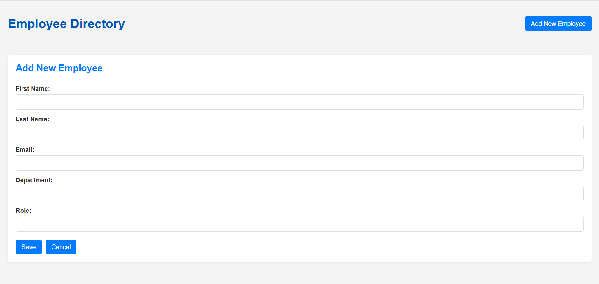
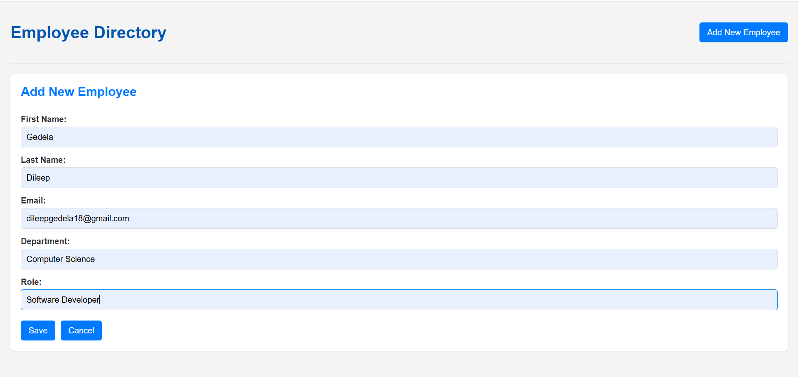
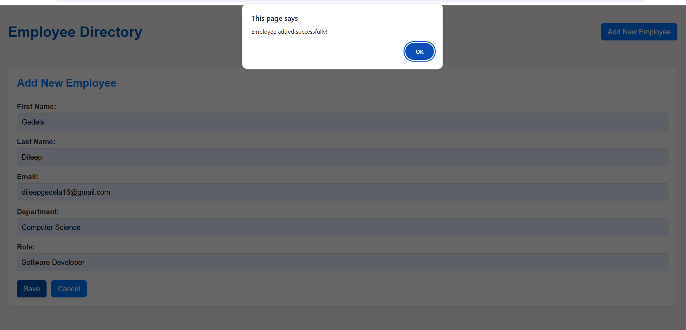
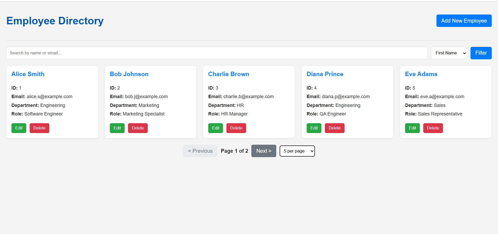
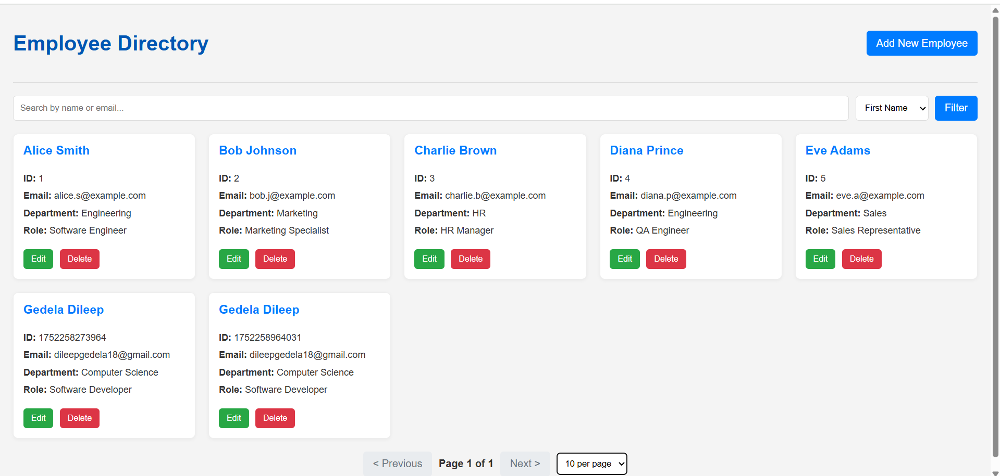
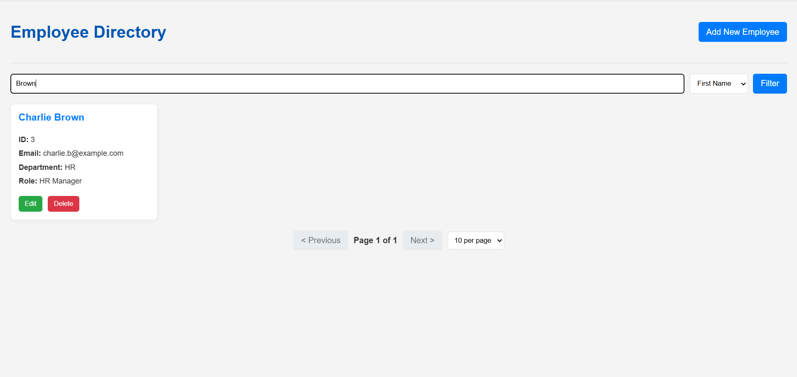
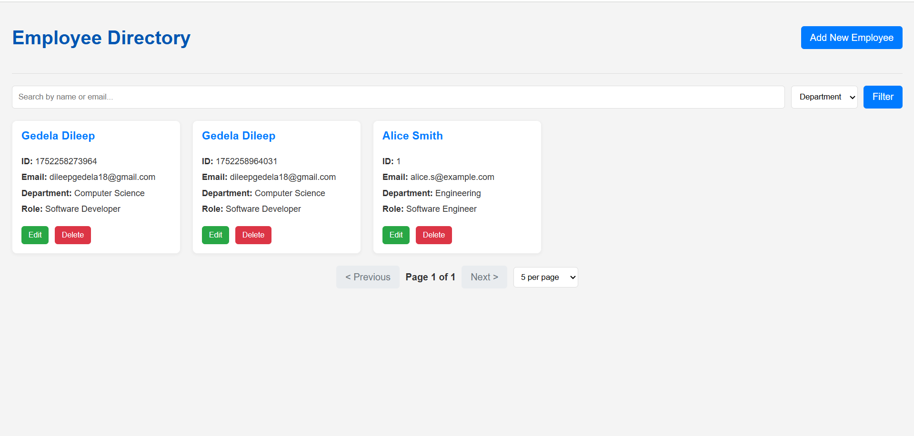
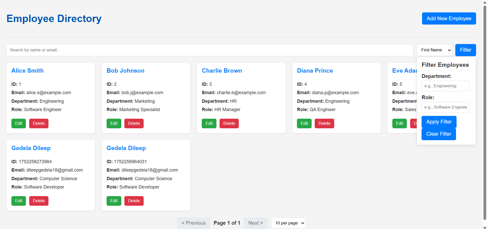

# Employee Directory App

A modern, responsive Employee Directory web application built with vanilla JavaScript, HTML, and CSS. This app allows you to view, add, edit, delete, search, filter, sort, and paginate employee records using mock data. It is designed for easy local development and can be extended for backend integration.

## Features

- View employees in a responsive card grid
- Add, edit, and delete employee records
- Search by name or email
- Filter by department and role
- Sort by first name or department
- Pagination with adjustable items per page
- Form validation with inline error messages
- Responsive design for desktop, tablet, and mobile

## Project Structure

```
employee-directory-app/
├── src/
│   └── main/
│       └── resources/
│           └── templates/
│               ├── dashboard.ftlh      # Main Freemarker template (simulated)
│               └── add-edit-form.ftlh  # Freemarker template for form (simulated)
├── public/
│   ├── css/
│   │   ├── style.css       # Main styling
│   │   └── responsive.css  # Media queries for responsiveness
│   ├── js/
│   │   ├── data.js         # Mock employee data
│   │   ├── employee.js     # Employee data model/utility functions
│   │   ├── ui.js           # UI rendering and DOM manipulation
│   │   ├── validation.js   # Form validation logic
│   │   └── app.js          # Main application logic
│   └── index.html          # Main entry point for local development
├── screenshots/            # Place for screenshots
└── README.md
```

## Getting Started

1. **Clone or Download the Repository**
2. **Open `public/index.html` in your browser**
   - No build step or server required; all logic is client-side.
   - The app uses mock data from `js/data.js`.

## Usage

- **Add Employee:** Click "Add New Employee" and fill out the form.
- **Edit Employee:** Click the "Edit" button on any employee card.
- **Delete Employee:** Click the "Delete" button and confirm.
- **Search:** Use the search box to filter by name or email.
- **Filter:** Click "Filter" to filter by department or role.
- **Sort:** Use the sort dropdown to sort employees.
- **Pagination:** Use the controls at the bottom to navigate pages and change items per page.

## Customization

- To add more mock employees, edit `public/js/data.js`.
- To integrate with a backend, replace the mock data logic with API calls.
- Styles can be customized in `public/css/style.css` and `public/css/responsive.css`.

## Screenshots

### Dashboard View


### Add Employee Form


### Add SuccessFullyEmployedData


### Show Data


### Show Data


### Search Input Filter


### All Filters Appiled


### Filters Apply to Show Data



---

**Author:** Dileep Gedela

